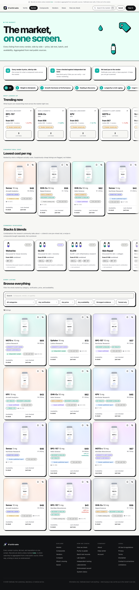
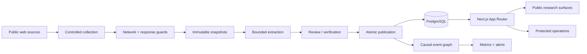

# VialGrade

[](https://github.com/pegg-dot/vial/actions/workflows/ci.yml)

**A production market-intelligence and verification system for the peptide market.**

VialGrade turns fragmented storefronts, laboratory certificates, public records, pricing, and vendor history into a source-linked research layer. It continuously collects public information, preserves what it saw, separates claims from evidence, and gives readers a way to inspect the receipts instead of trusting a single score.

**Live:** https://vialgrade.com

VialGrade does not sell peptides, process checkout, or provide medical advice. When a listing is actionable, the product links to the vendor's own site.

<p align="center">
  
</p>

## Why I built it

The hard part of this market is not finding another purity number. It is deciding whether the number means anything.

A storefront can change overnight. A certificate can be real but belong to a different batch. A laboratory page can disappear. A vendor can rebrand. A price can be cheap because the vial contains less material. A server can refuse automated verification even when a certificate is legitimate.

VialGrade treats those as data-model and provenance problems, not copywriting problems.

The core rule is simple:

```text
source -> captured record -> normalized claim -> evidence -> review -> published state
```

Every important answer should be traceable back toward the source that produced it, and uncertainty stays visible rather than being silently converted into certainty.

## What is in the system

- **Market data engine** for compounds, vendors, listings, normalized prices, availability, and cross-vendor comparison
- **Evidence graph** for COAs, batches, laboratories, methods, samples, reports, and provenance
- **Verification flow** for vendor domains, certificate identifiers, uploaded documents, known records, and conflicting evidence
- **Vendor intelligence** built from testing history, storefront behavior, public records, enforcement signals, and market context
- **Collection scheduler** with durable targets, bounded concurrency, retries, freshness tracking, immutable captures, and retention
- **Human review boundaries** between collected observations and high-impact publication
- **Account and staff systems** with revocable sessions, role/permission checks, audit events, and protected operational surfaces
- **Causal event traces** so downstream metric changes and alerts remain attached to the source event that caused them
- **Operational tooling** for health, collection coverage, provenance refresh, source failures, review queues, and live verification

## Architecture

VialGrade is a Next.js modular monolith backed by PostgreSQL in production and PGlite for isolated local/test workflows.



The application is intentionally not split into a large collection of services yet. Domain boundaries live inside `src/server/`, while transactions, authorization, and publication rules stay close enough to reason about end to end.

### Collection is treated as hostile input

Third-party content is untrusted. Live HTTP collection applies hostname and network controls before content reaches the extraction path, including protocol/port restrictions, DNS resolution, private-network blocking, redirect revalidation, response-size limits, content-type checks, and timeouts.

Captured text cannot change sessions, roles, publication policy, transaction state, or tool budgets. Free-form model output is not allowed to decide permissions, money, eligibility, or other hard system boundaries.

### Evidence is not flattened into one magic score

A laboratory document is not the same thing as proof about a physical vial. VialGrade keeps laboratory, method, sample, custody, result, report, batch, and storefront context separable so missing evidence remains missing evidence.

That distinction is especially important in `/verify`: unreachable external pages do not automatically become fraud, fuzzy vendor-name matches do not inherit another vendor's reputation, and document parsing is bounded so an uploaded file cannot become a database-query amplifier.

## Security model

Security here is a set of concrete controls, not a claim that the system is impossible to break.

Implemented controls include:

- fail-closed production environment validation
- HMAC-signed, expiration-bounded session envelopes
- server-side session lookup and revocation before privileged work
- `HttpOnly`, `Secure`, `SameSite=Strict` authentication cookies in production
- deny-by-default route policy plus server-side defense-in-depth guards
- role and permission checks for staff, seller, and laboratory surfaces
- timing-safe secret comparison
- login throttling by both account and privacy-preserving IP hash
- same-origin checks for browser mutations
- Content Security Policy, HSTS, frame denial, MIME sniffing protection, restrictive referrer policy, and Permissions Policy
- SSRF-oriented network controls on live source collection and redirect revalidation
- bounded parsers, response-size limits, timeouts, concurrency limits, and query-shape controls
- separate cron authorization secret
- audit events and operational receipts for sensitive workflows
- automated static security checks, role-boundary audits, dependency audit, unit/integration tests, and browser tests

See [`SECURITY.md`](SECURITY.md) for the disclosure policy and [`docs/THREAT_MODEL.md`](docs/THREAT_MODEL.md) for the deeper threat model.

## Verification and release gates

The full local/CI verification path is intentionally much heavier than a framework build:

```bash
npm ci
npm run verify
```

`npm run verify` covers linting, TypeScript, unit and integration tests, security audits, database restore checks, dependency auditing, production build validation, HTTP role-boundary checks, and accessibility checks.

The Vercel production path also has a release gate inside `scripts/build.mjs`. A production build refuses to ship if the environment contract, TypeScript check, or fast unit suite fails. This matters because the live Git integration can begin a deployment immediately after a push, before a separate CI workflow has finished.

The optional GitHub Actions -> Vercel promotion job is deliberately opt-in. It should only be enabled after a valid Vercel deploy credential is installed and Vercel's direct Git deployment is disabled. There should never be two competing production authorities.

## Run locally

Requirements:

- Node.js 20.9+
- npm 10+

```bash
git clone https://github.com/pegg-dot/vial.git
cd vial
npm ci
cp .env.example .env.local
npm run dev
```

The default local path can use PGlite. Production uses managed PostgreSQL and fails closed when required secrets or persistence configuration are absent.

Do not put real credentials in `.env.example`. It documents variable names and safe defaults only.

## Useful commands

```bash
npm run dev                 # local app
npm run lint                # ESLint
npm run typecheck           # TypeScript without emit
npm run test:unit           # fast unit suite
npm run test:integration    # isolated integration suite
npm run test:e2e            # Playwright
npm run audit:security      # static security boundary audit
npm run audit:roles         # HTTP role/route audit
npm run db:backup-drill     # backup/restore contract
npm run verify              # full verification gate
npm run verify:live         # check claims against the live deployment
```

## Repository map

```text
src/app/             Next.js routes, server-rendered pages, route handlers
src/components/      UI and interactive client islands
src/server/auth/     authentication, sessions, roles, permissions, audit events
src/server/db/       PostgreSQL/PGlite adapter, schema and migrations
src/server/collect/  schedulers, source collection and capacity controls
src/server/external/ guarded third-party network access
src/server/ingest/   normalization and ingestion workflows
src/server/market-data/ canonical market-data engine
src/server/evidence-network/ laboratory/report/sample evidence model
src/server/security/ rate limits and security utilities
scripts/             release gates, audits, health checks, ingestion utilities
tests/               unit, integration and browser-level verification
docs/                architecture, threat model, operational and design decisions
audits/              measured UI/performance review artifacts
```

## Engineering decisions worth inspecting

If you are reviewing the repo, these are more representative than the homepage styling:

1. **`src/server/external/`**: network boundaries for collecting hostile third-party data without turning the application into an SSRF proxy.
2. **`src/server/auth/` + `src/proxy.ts`**: signed session perimeter, revocation-backed principals, deny-by-default routing, and permission checks.
3. **`src/server/collect/`**: capacity-aware scheduled collection where cadence, claim windows, retries, and runtime budgets are explicit rather than hidden in cron strings.
4. **`src/server/evidence-network/`**: modeling that keeps a document, a sample, a result, a report, and a batch from collapsing into the same fact.
5. **`scripts/static-security-audit.mjs`**: an audit that self-tests its own ability to reject known-bad code before trusting a green result.
6. **`.github/workflows/ci.yml` + `scripts/build.mjs`**: release verification designed around the actual deployment race rather than assuming CI automatically blocks a hosting provider.

## Data and safety boundaries

VialGrade aggregates information from public sources and stores source-linked records for research and comparison. A listing, grade, laboratory result, or displayed claim is not medical advice, a guarantee of product safety, or an endorsement.

The live site is informational. There is no VialGrade cart or checkout flow.

## Documentation

- [`docs/ARCHITECTURE.md`](docs/ARCHITECTURE.md)
- [`docs/THREAT_MODEL.md`](docs/THREAT_MODEL.md)
- [`docs/CI-MUST-PASS-BEFORE-DEPLOY.md`](docs/CI-MUST-PASS-BEFORE-DEPLOY.md)
- [`docs/MONITORING.md`](docs/MONITORING.md)
- [`docs/LEGAL_BOUNDARIES.md`](docs/LEGAL_BOUNDARIES.md)
- [`CHANGELOG.md`](CHANGELOG.md)

---

Built as a real data system first. The interface is the part people see; provenance, verification, scheduling, failure handling, and access control are the part that make it worth trusting.