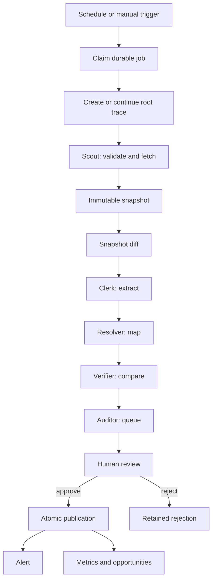

# Agent System

## Current truth

VIAL runs a bounded, tool-oriented workflow for source refresh and publication. The specialist stages are implemented with deterministic code so the initial system is reproducible, testable, and easy to audit.

The design supports future model-assisted extraction or entity resolution, but no free-form model output controls authentication, permissions, publication, alerts, opportunity state, or transactions.

## Operating principle

Agents observe, fetch, extract, resolve, compare, and propose. Conventional code enforces network boundaries, schemas, roles, state transitions, transactions, and event lineage. A human decides whether an atomic market claim reaches the public catalog.

## Implemented orchestration

### Atlas: refresh orchestrator

Atlas is represented by the scheduler and pipeline coordinator. It receives a bounded source policy and job, then calls deterministic specialist tools.

It is responsible for:

- Claiming one durable job
- Starting or continuing one causal trace
- Enforcing attempt count and retry budget
- Selecting fixture or safe HTTP transport
- Passing content into the extraction pipeline
- Recording success, no-change, recovery, or failure
- Preserving the root event across the complete workflow

### Scout: source and transport layer

Responsibilities:

- Validate the source policy
- Enforce the hostname allowlist
- Resolve DNS before connecting
- Reject private and reserved addresses
- Revalidate every redirect
- Enforce timeout, response-size, and content-type limits
- Capture ETag and Last-Modified metadata
- Reuse deterministic fixture content in local simulations
- Create or reuse the canonical source and immutable snapshot

### Clerk: bounded extraction

Responsibilities:

- Parse HTML, JSON-LD, JSON, plain text, or document-like content
- Remove scripts, styles, templates, and obvious prompt-injection instructions
- Emit only schema-valid claims
- Use the source's parser profile
- Keep the strongest candidate per predicate

### Resolver: canonical mapping

Responsibilities:

- Map the observation to the policy-selected listing
- Attach explicit subject type and ID
- Avoid automatically creating a vendor, compound, product, or listing
- Route ambiguous future mappings to human review

### Verifier: comparison and anomaly layer

Responsibilities:

- Load the current published value
- Compare the new snapshot with the previous one
- Suppress unchanged source captures
- Suppress unchanged field observations
- Raise risk for unusually large price changes
- Preserve previous value, proposed value, source snapshot, and rationale

### Auditor: publication gate

Responsibilities:

- Create pending atomic claims
- Assign risk level
- Require human review for every changed claim
- Require administrator approval for high-impact claims
- Block unsupported trust language
- Keep rejection records

### Watchtower: causal alerts

Responsibilities:

- Generate alerts only from reviewed publications or explicit operational failures
- Keep the alert attached to the source trace
- Route listing alerts into the watchlist feed
- Distinguish informational, notice, warning, and critical severity
- Avoid creating medical or product-use recommendations

### Curator: opportunity engine

Responsibilities:

- Recompute compound and vendor metrics
- Detect second-order market or operational conditions
- Open or update a stable opportunity signal
- Preserve first-seen and last-seen times
- Support staff lifecycle states
- Expose only selected non-recommendation signals publicly

## Controlled refresh loop



Every stage writes a receipt or domain event with structured input, output, status, and duration.

## Parser profiles

The source policy chooses one of these current profiles:

- `generic`: HTML, text, and JSON-LD catalog extraction
- `jsonld`: prioritizes structured offer data
- `catalog`: permits the complete bounded listing vocabulary
- `document`: suppresses commerce fields and focuses on report metadata

The profile narrows behavior. It does not grant permission to publish.

## Claim risk

- `standard`: routine catalog fields such as price and availability
- `material`: batch, report, shipping, or unusually large price changes
- `high-impact`: issuer confirmation or another trust-changing claim

A reviewer cannot approve a high-impact claim. An administrator can approve or reject it.

## Opportunity taxonomy

The current signal engine can surface:

### Source operations

- `source-health`
- `source-coverage-gap`

### Listing integrity

- `listing-evidence-refresh`
- `new-batch-evidence`
- `batch-document-gap`
- `listing-price-outlier`

### Vendor records

- `vendor-evidence-gap`
- `vendor-onboarding`

### Compound market structure

- `price-dispersion`
- `thin-availability`
- `compound-evidence-gap`
- `issuer-concentration`
- `supply-concentration`

Signals describe a data or market-structure condition. They do not instruct a user to purchase, ingest, inject, or use a product.

## Idempotency

The ingestion workflow key combines:

```text
canonical source location
content hash
target listing
extractor workflow version
```

The refresh scheduler also uses a job idempotency key. Repeating the same scheduled interval or explicit trigger returns the existing job rather than creating duplicate work.

Opportunity signals use a stable semantic key, such as one compound or listing condition, so repeated sweeps update the existing signal.

## Retry behavior

- A job records one attempt per claim.
- A failed attempt moves to retrying when budget remains.
- Delay follows bounded exponential backoff.
- The final failure opens a source-health signal and can generate a warning alert.
- A later successful refresh can generate a recovery alert.

## Prompt-injection defense

The current layer:

- Removes script, style, template, and noscript content
- Treats captured text as hostile data
- Drops common instructions to ignore prompts, invoke tools, or mark a vendor verified
- Uses an allowlisted predicate schema
- Requires human review
- Prevents source text from altering permissions, budgets, transport, or publication policy
- Performs transport validation before content reaches the parser

This is defense in depth, not a complete malicious-content classifier.

## What conventional code controls

- Authentication and roles
- Source policy and network allowlists
- Job claiming and retries
- Database transactions
- Claim and publication state
- Causal roots and event edges
- Alert and opportunity persistence
- Checkout mode
- API authorization
- Public projection

No free-form model output controls these functions.

## Evaluation coverage

### Unit tests

- Structured price and availability
- Evidence metadata extraction
- Prompt-injection instruction filtering
- Predicate deduplication
- Private, loopback, reserved, documentation, and multicast address blocking
- URL scheme, credentials, port, hostname, and resolved-network controls
- Immutable snapshot diff behavior

### Integration tests

- Idempotent workflow replay
- High-impact role gate
- Atomic price publication
- Versioned receipt and public projection
- Controlled fixture mutation
- One-root source-to-signal cascade
- Batch-change alert
- New-batch evidence signal
- Whole-market opportunity sweep
- One scheduler claim and one attempt receipt

### Browser tests

- Public health and protected API behavior
- Staff login
- Manual source ingestion
- Claim review and publication
- Public catalog update
- Controlled fixture refresh
- Cascade trace visibility
- Public signals route
- Search, filters, watchlist, comparison, and mobile navigation

## Next agent phase

Add model assistance only where deterministic extraction has measured limits:

1. Build a labeled benchmark.
2. Record per-field precision, recall, and abstention.
3. Add an ambiguity queue.
4. Test a model-assisted extractor behind the same schema.
5. Compare it against deterministic baselines.
6. Keep the existing human publication gate.

The next operational tools should focus on reviewer assignment, source policy templates, source disputes, and durable notifications rather than broader autonomous browsing.

## VIAL Laboratory MCP

The V6 laboratory MCP server exposes scoped read tools and proposal tools. It can inspect laboratory status, orders, methods, and custody and prepare analytical-result or report-draft proposals. It cannot approve a result, sign or issue a report, revoke a report, publish a passport, or change evidence policy. Those authorities remain in conventional permissioned application code.
