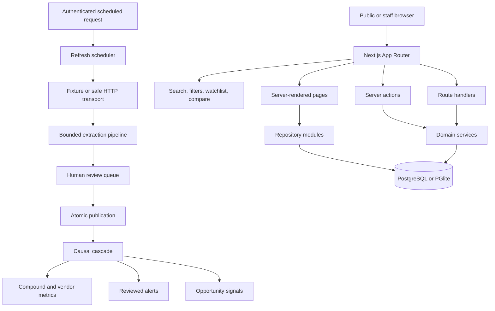
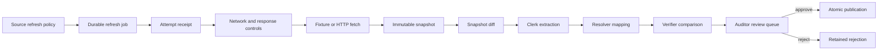
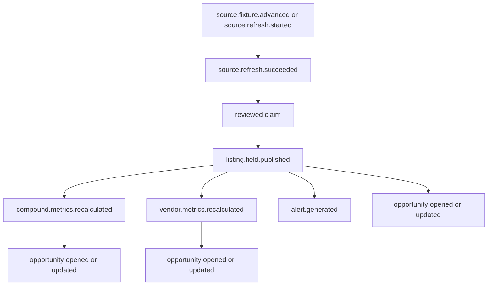

# Architecture

## Current implementation

VIAL is a Next.js modular monolith backed by PostgreSQL-compatible storage. It now includes a controlled refresh scheduler and a causal intelligence graph.

## Public surface

- Home, market, compound, product, vendor, compare, watchlist, methodology, operations, and signals
- Server-rendered catalog and intelligence records
- Client islands only where browser state or immediate interaction is required
- Browser storage for anonymous watchlists and compare selections
- Reviewed listing alerts loaded from the public read-only API

## Staff surface

- Signed HttpOnly session cookie
- Administrator and reviewer roles
- Manual source capture
- Controlled source policies and fixture simulations
- Durable refresh jobs and attempt receipts
- Human review queue
- Opportunity workspace
- Causal trace explorer
- Publication and tool-call ledgers

## API surface

- `GET /api/v1/health`
- `GET /api/v1/catalog`
- `GET /api/v1/alerts?slugs=...`
- `GET /api/v1/runs`, staff-only
- `POST /api/internal/cron/refresh`, protected by `CRON_SECRET`
- `GET /api/openapi.json`

## Storage adapters

### Local development

PGlite stores a PostgreSQL-compatible database in `.data/pglite`. It can also run in memory for builds, tests, and audit servers through `VIAL_PGLITE_MEMORY=true`.

### Deployed environments

When `DATABASE_URL` is set, the application uses a `pg` connection pool. Deployed environments must use managed persistence rather than a local serverless filesystem.

## Controlled source-refresh flow

A source can use either:

- `fixture` transport for deterministic local simulations
- `http` transport for a real allowlisted source

Live HTTP is constrained before any content reaches the extractor:

- HTTP or HTTPS only
- No embedded credentials
- Ports 80 or 443 only
- Explicit per-source hostname allowlist
- DNS resolution before the request
- Private, loopback, link-local, documentation, multicast, and reserved addresses blocked
- Each redirect revalidated
- Maximum response bytes
- Allowed content types
- Request timeout
- Conditional request metadata through ETag and Last-Modified

## Causal cascade

An approved claim does more than update one listing. VIAL creates an explicit event tree under the same root that began the source change.

Every child receives:

- `root_event_id`
- `parent_event_id`
- actor
- entity type and ID
- structured payload
- a typed edge describing the relationship

This prevents silent side effects and prevents a publication cascade from accidentally creating a second trace root.

## Opportunity engine

Opportunity signals are derived operational and market-intelligence conditions. They are not medical or product recommendations.

Examples include:

- Source coverage gap
- Source health degradation
- Listing evidence refresh
- New batch evidence gap
- Batch-document gap
- Vendor evidence gap
- Vendor onboarding opportunity
- Price dispersion
- Listing price outlier
- Thin availability
- Compound evidence gap
- Issuer concentration
- Supply concentration

Signals are persistent entities with a stable `signal_key`. Repeated observations update the same signal, preserve first-seen time, and allow staff to mark it open, watching, resolved, or dismissed.

## Domain modules

### Catalog

Compounds, products, listings, normalized public projections, prices, availability, and dimensional evidence summaries.

### Organizations

Vendor identities, aliases, domains, profile status, participation state, display metrics, and history.

### Sources and refresh

Canonical locations, immutable snapshots, diffs, source policies, fixtures, jobs, attempts, retries, and source health.

### Claims and publication

Atomic observations, previous values, confidence, risk, human decisions, transactional field mutation, versioning, and receipts.

### Intelligence

Domain events, trace edges, metric snapshots, reviewed alerts, opportunity signals, and whole-market sweeps.

### Operations

Run status, tool calls, idempotency, durations, proposed changes, publication counts, failures, queue state, and scheduler health.

### Policy and commerce

Deferred. Current listing checkout mode is information-only. No payment or transaction module exists.

## Consistency model

- A source snapshot is immutable.
- A repeated source and content pair is deduplicated.
- A repeated workflow input returns the existing run receipt.
- A scheduled job is claimed exactly once per attempt.
- One approval applies one predicate to one listing.
- Publication, receipt creation, metric updates, alert creation, and immediate signals occur inside one transaction.
- Every cascade remains attached to its original root event.
- A stable opportunity key updates one signal instead of creating duplicates.
- High-impact claims require the administrator role.
- Public views read the same database state changed by publication.

## Security boundaries

- Captured source text is untrusted data.
- The extraction vocabulary is allowlisted.
- Obvious prompt-injection instructions are removed before extraction.
- Source text cannot alter sessions, roles, tool budgets, publication rules, or transaction states.
- Live transport uses hostname and network controls before connection.
- Redirects do not inherit trust automatically.
- Money, eligibility, and permissions never depend on free-form model output.
- Staff sessions are HMAC-signed and stored in HttpOnly cookies.
- Production requires explicit tokens and a session secret.
- The cron route requires a separate secret.
- Protected run receipts return `401` without staff authentication.

## Current limitations

- Migrations are versioned and version-gated (`schema_migrations`, `CURRENT_SCHEMA_VERSION`),
  but each migration body is a `CREATE TABLE / ADD COLUMN IF NOT EXISTS` snapshot: editing an
  already-applied schema module does not re-run, so column type/constraint changes on populated
  tables are not yet expressible. A drift guard (`audit:registry`, `migration-integrity` test)
  fails if the version count diverges from the registered migrations.
- Source artifacts are stored in PostgreSQL rather than content-addressed object storage, and the
  rendered report/raw-data artifacts behind `document_hash`/`raw_data_hash` are not persisted — so
  verification confirms a hash VIAL holds but cannot yet reproduce the artifact for an outsider.
- No real external source is enabled in the fictional seed.
- No robots or terms policy evaluation is automated.
- The extractor is deterministic; the model provider seam exists but stays inert until benchmarked
  and approved.
- Anonymous watchlists remain browser-local.
- Web push delivery ships (self-hosted VAPID); email and durable cross-device notification delivery
  do not.
- Reviewer assignment, queue aging, and second-review rules are not implemented.

## Scaling path

1. Labeled extraction and change-detection benchmark
2. Delta (non-snapshot) database migrations for evolving populated tables
3. Object storage for large source artifacts and reproducible report/raw-data verification
4. Reviewer assignment and alert delivery service
5. Authenticated accounts and durable watchlists
6. Seller feeds and correction workflows
7. Search specialization after measured need
8. Carefully gated policy and commerce modules only if legally supportable

## VIAL 2.0 market-data plane

V2 adds four bounded modules inside the modular monolith:

1. `market-data/graph` owns canonical identities, aliases, and relationships.
2. `market-data/benchmarks` owns parser contracts, golden sets, and evaluation runs.
3. `market-data/quality` owns freshness, corrections, source reliability, and pilot state.
4. `search/engine` owns deterministic indexing, query expansion, ranking, logs, and evaluation.

The data plane remains transactional and database-backed. Search can later move to a dedicated index without changing canonical entity IDs or the public result contract.
