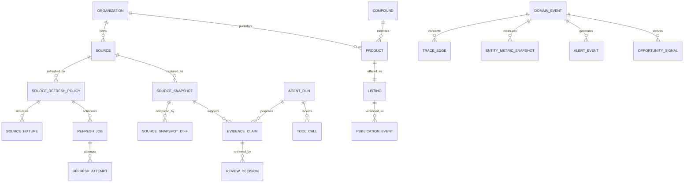

# Data Model

## Modeling rule

A compound, organization, product, listing, source, snapshot, claim, review decision, publication event, refresh job, domain event, metric, alert, and opportunity are separate records. Keeping them separate preserves what was observed, who reviewed it, what changed, and which downstream effects were created.

## Implemented graph



## Catalog tables

### `organizations`

Fictional vendor profiles, domains, aliases, participation state, display metrics, and persistent history.

### `compounds`

Canonical names, aliases, category, descriptive research context, optional chemical identifiers, and derived market metrics.

### `products`

A vendor's packaged product concept with a compound relationship, declared quantity, and declared form.

### `listings`

The current public market state for a product:

```text
price
previous_price
availability
shipping_claim
report_date
report_issuer
report_confirmed
batch_code
last_checked
checkout_mode
price_history
evidence
```

## Source and workflow tables

### `sources`

A canonical source location, source type, owner organization, label, and last observation metadata.

### `source_snapshots`

Immutable captured content with a SHA-256 content hash, content type, metadata, capture mode, parser context, and creator. The pair of source and content hash is unique.

### `agent_runs`

One idempotent workflow receipt with target, workflow version, status, tool budget, proposed and published counts, sanitized input summary, output, actor, duration, and failure reason.

### `tool_calls`

Every named stage records input, output, duration, completion state, and error message.

### `evidence_claims`

One atomic proposed statement:

```text
subject_type
subject_id
predicate
value_json
previous_value_json
source_snapshot_id
agent_run_id
extractor_version
model_confidence
verification_status
review_status
risk_level
rationale
```

The current predicate vocabulary is deliberately narrow:

```text
price
availability
shipping
batchCode
reportDate
reportIssuer
reportConfirmed
```

### `review_decisions`

Reviewer role, label, decision, reason, notes, and time.

### `publication_events`

An append-only version record containing published claim IDs, complete before state, complete after state, superseded version, publisher, timestamp, and the root event responsible for the change.

## Refresh tables

### `source_refresh_policies`

One operational policy for one canonical source and listing target:

```text
transport
parser_profile
enabled
interval_minutes
next_run_at
last_started_at
last_succeeded_at
last_failed_at
consecutive_failures
timeout_ms
max_response_bytes
allowed_content_types
allowed_hostnames
etag
last_modified
```

### `source_fixtures`

Versioned fictional source bodies used for deterministic demonstrations and tests. Only one fixture version is active for a policy at a time.

### `refresh_jobs`

Durable work items with trigger, priority, availability time, attempt count, retry budget, idempotency key, result, and failure state.

### `refresh_attempts`

One receipt per claimed attempt:

```text
attempt_number
status
started_at
completed_at
duration_ms
http_status
bytes_received
resolved_ip
content_type
error_code
error_message
metadata
```

### `source_snapshot_diffs`

Immutable summaries connecting the prior and current snapshots with changed status, line counts, content hashes, and compact added or removed previews.

## Intelligence tables

### `domain_events`

Typed facts in the causal graph:

```text
id
root_event_id
parent_event_id
event_type
entity_type
entity_id
actor
payload_json
occurred_at
```

A root event points to itself. Every downstream child keeps the same root.

### `trace_edges`

Explicit relationships between events, such as:

```text
triggered-refresh
produced-snapshot
published-reviewed-claim
recalculated-compound
generated-alert
opened-opportunity
```

The triple of from-event, to-event, and relation is unique.

### `entity_metric_snapshots`

A metric value tied to the exact event that produced it. Examples include median price, documentation coverage, available listing count, source refresh duration, and concentration measures.

### `alert_events`

Reviewed or operational notifications with severity, category, target entity, message, structured data, and causal root.

### `opportunity_signals`

Persistent second-order conditions with:

```text
signal_key
root_event_id
event_id
signal_type
entity_type
entity_id
title
summary
score
confidence
status
evidence_json
first_seen_at
last_seen_at
resolved_at
resolution_note
```

A stable `signal_key` lets later sweeps update the same signal while retaining first-seen time and staff status.

## Publication transaction

An approved claim executes in one transaction:

1. Lock the claim and listing.
2. Confirm the claim is still pending.
3. Enforce the role gate.
4. Record the review decision.
5. Apply exactly one approved predicate.
6. Create the next publication version.
7. Attach the publication to the upstream root event.
8. Recalculate compound metrics.
9. Recalculate vendor metrics and history.
10. Generate a reviewed listing alert.
11. Open or update immediate opportunity signals.
12. Mark the claim published and settle the agent run.

If any step fails, the transaction rolls back.

## Whole-market sweep

The scanner creates its own root event, computes cross-record conditions, records metric snapshots, and opens or updates signals. It does not mutate listings and does not bypass review.

## Deferred entities

The schema now implements durable users, preferences, watchlists, sellers, activation decisions, carts, orders, refunds, disputes, provider payments, transfers, reserves, payouts, and settlement. Still deferred are:

- Physical sample and chain-of-custody records
- Structured laboratory analytical results
- Real laboratory account and accreditation workflows
- Production provider credentials and external settlement records

Those require the V6 evidence network or approved external integrations.

## Persistence modes

- Local: `.data/pglite`
- Test, build, and controlled audits: in-memory PGlite
- Deployment: managed PostgreSQL through `DATABASE_URL`

The public slugs are stable across adapters.

## VIAL 2.0 market-data tables

- `canonical_entities`
- `entity_aliases`
- `entity_relationships`
- `entity_resolution_cases`
- `source_pilots`
- `parser_contracts`
- `benchmark_datasets`
- `benchmark_examples`
- `benchmark_runs`
- `confidence_models`
- `correction_feedback`
- `source_reliability_snapshots`
- `freshness_policies`
- `data_freshness_status`
- `search_synonyms`
- `search_documents`
- `search_query_logs`
- `search_evaluations`

Canonical IDs are stable across search, provenance, review, publication, and future APIs. Freshness and reliability remain separate from product quality or suitability.

## VIAL 5 commerce tables

- `commerce_provider_accounts`
- `commerce_provider_onboarding_sessions`
- `commerce_activation_policies`
- `commerce_activation_decisions`
- `commerce_provider_payment_intents`
- `commerce_provider_transfers`
- `commerce_reserve_holds`
- `commerce_tax_transactions`
- `commerce_fraud_decisions`
- `commerce_fulfillment_quotes`
- `commerce_settlement_runs`
- `commerce_underwriting_reviews`

Provider records remain separate from VIAL orders and ledger entries so external state, internal accounting, and policy decisions can be reconciled independently.

## VIAL 6 evidence and laboratory domains

```text
laboratory_profiles
laboratory_team_members
laboratory_onboarding_sessions
laboratory_onboarding_steps
laboratory_methods
testing_programs
laboratory_test_orders
sample_kits
laboratory_samples
sample_custody_events
analytical_runs
analytical_results
laboratory_reports
laboratory_report_events
batch_passports
passport_evidence_links
evidence_conflicts
laboratory_work_proposals
laboratory_api_tokens
```

The physical sample is the central evidence anchor. Reports reference reviewed results, results reference analytical runs, runs reference method versions and samples, and passports link report/result evidence without deleting conflicts or inactive report history.
